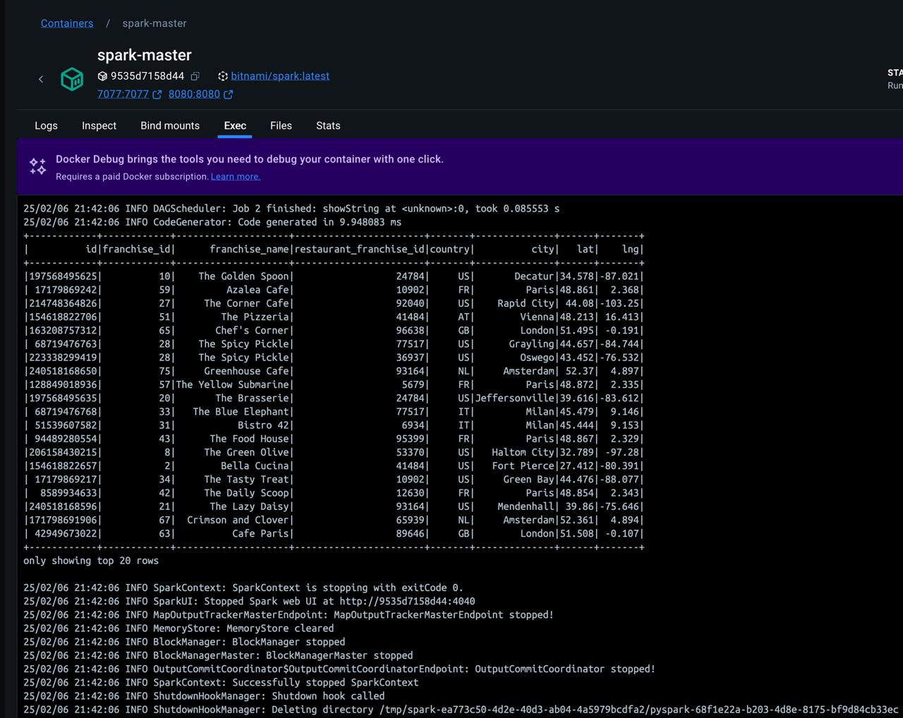

# Merge DataFrames with Duplicate Column Names in PySpark

This repository contains a simple PySpark example that demonstrates how to merge (join) two DataFrames 

## Overview

The code:
- Creates two sample DataFrames from restaurants csv files and weather parquet data
- Avoid null values of latitude and longitude by finding coordinates using opencagedata API
- Merges (joins) the two DataFrames on the created geohashes by latitude and longitude data
- Displays and saving the resulting merged DataFrame in a parquet

## Runing 

- Replace in docker-compose.yml <path_to_local_clone_of_repo> and <your_opencage_api_key> 
- Run 
```
docker-compose up -d
```
- Run in a spark-master 
```
pip install requests pyspark geohash
```
- Run in a spark-master
```
spark-submit --master local[*] /app/data/etl_job.py
```
or for debugging and prerequests of this task
```
spark-submit --master local[*] /app/data/etl_read_ob.py
```

